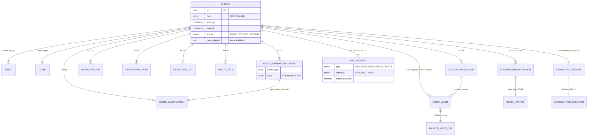
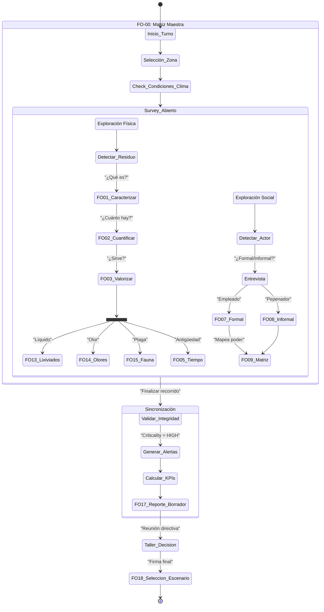

# Canvas #20: Arquitectura Maestra de Operación "Revalora Circular"

## Identidad del Formato

- **Versión:** 2.0 (Deep Dive)
- **Propósito:** Definir topología de datos, flujo operativo e inteligencia del sistema completo.

## Vista 1. Topología de Datos (ERD)

Diagrama que muestra cómo se estructura la base de datos para preservar integridad referencial y trazabilidad ISO 27001. El survey es el centro de gravedad.

## Vista 2. Flujo Operativo de la Brigada (Workflow)

Secuencia que sigue la brigada en la app, con validaciones, bifurcaciones y bloqueos lógicos.

## Vista 3. Motores de Inteligencia

Reglas transversales que cruzan la información de los 19 formatos para generar acciones tácticas y estratégicas.

- **Motor 1 · Calculadora de Viabilidad de Rescate (Food Rescue Engine)**
  - Inputs: FO-01 estado físico, FO-05 tiempo expuesto (<4 h), FO-13 contacto con lixiviados, FO-15 fauna cercana.
  - Lógica escalonada:
    - Si el lote está fresco, con menos de 4 horas expuesto y sin contaminantes ni fauna, destino `Consumo Humano`.
    - Si está magullado pero sin contaminación, redirigir a `Alimento Animal`.
    - En cualquier otro caso, enviar a `Biodigestor/Composta`.

- **Motor 2 · Detector de Zonas de Guerra (Conflict Heatmap)**
  - Inputs: densidad de actores informales (FO-08), resistencia social >70 % (FO-09), bloqueos de seguridad (FO-16).
  - Output: marcar zona como `No-Go` en FO-11 y bloquear órdenes para contenedores (FO-10) hasta resolver la negociación.

- **Motor 3 · Predicción de Colapso Logístico**
  - Inputs: hora pico (FO-04), volumen horario (FO-02) y capacidad de flota por turno (FO-12).
  - Regla: si el volumen supera la capacidad disponible, disparar alerta de déficit y sugerir en FO-17 la renta de unidades adicionales.

## Integración Final: Tablero de Mando

Todos los formatos alimentan un dashboard central con cuatro cuadrantes:

- **Operativo:** cantidad de residuos y logística (FO-01, FO-02, FO-04, FO-05, FO-06, FO-10, FO-12).
- **Sanitario:** riesgos biológicos activos (FO-13, FO-14, FO-15).
- **Social:** control territorial y alianzas (FO-07, FO-08, FO-09).
- **Estratégico:** decisiones ejecutivas y escenarios (FO-17, FO-18).

## Conclusión de Arquitectura

El ecosistema opera como un organismo vivo: los datos se originan en observaciones sensoriales, atraviesan validaciones técnicas y sociales, y culminan en decisiones ejecutivas respaldadas por la inteligencia de negocio.
